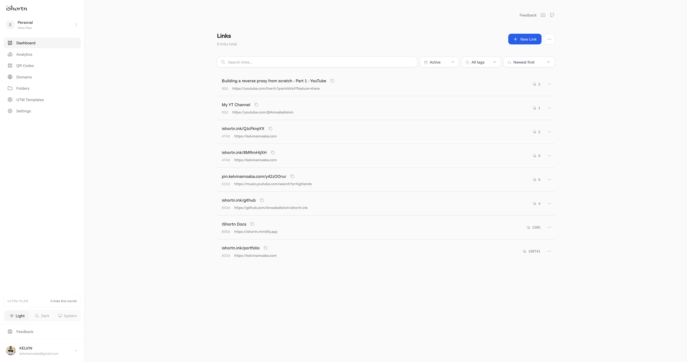
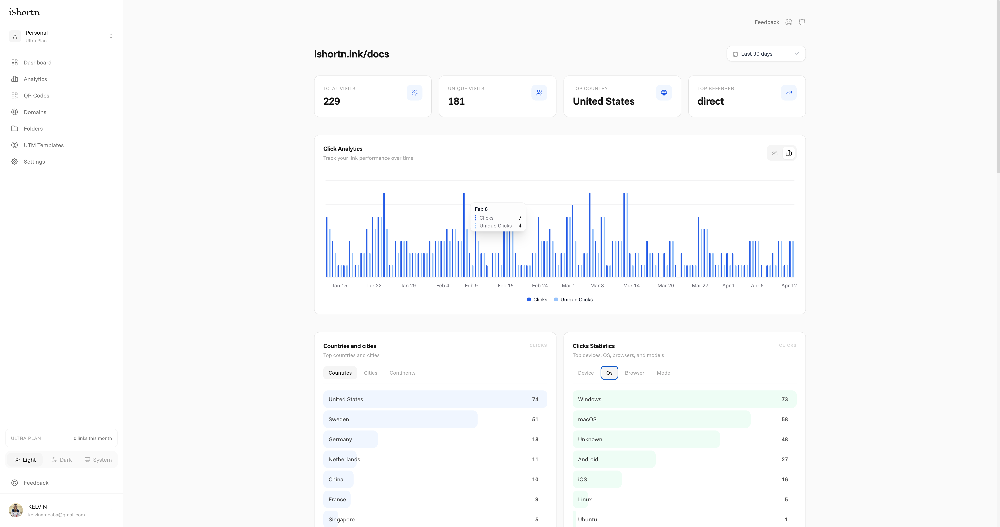

<h1 align="center">iShortn</h1>

<p align="center">
  Short links that track every click. Create branded short links with powerful analytics, QR codes, UTM templates, custom domains, and more.
</p>

<p align="center">
  <a href="https://ishortn.ink">ishortn.ink</a> &nbsp;·&nbsp;
  <a href="#about">About</a> &nbsp;·&nbsp;
  <a href="#features">Features</a> &nbsp;·&nbsp;
  <a href="#screenshots">Screenshots</a> &nbsp;·&nbsp;
  <a href="#tech-stack">Tech Stack</a> &nbsp;·&nbsp;
  <a href="#getting-started">Getting Started</a> &nbsp;·&nbsp;
  <a href="#contributing">Contributing</a>
</p>

<p align="center">
  <a href="https://github.com/AmoabaKelvin/ishortn.ink/blob/main/LICENSE">
    
  </a>
  <a href="https://github.com/AmoabaKelvin/ishortn.ink/stargazers">
    
  </a>
  <a href="https://github.com/AmoabaKelvin/ishortn.ink/network/members">
    
  </a>
  <a href="https://github.com/AmoabaKelvin/ishortn.ink/issues">
    
  </a>
</p>

<br />

<p align="center">
  
</p>

<br />

## About

iShortn is an open-source URL shortener and link intelligence platform. It turns long URLs into short, branded links and gives you deep insight into every click — country, city, device, referrer, and hour-by-hour trends — without shipping third-party cookies or chasing visitors across the web.

Use it for marketing campaigns, product onboarding, event tracking, newsletter links, QR codes on printed material, or as a self-hosted alternative to proprietary shorteners.

## Features

### Link management

- Custom short aliases and friendly names
- Custom domains
- Password-protected links
- Expiration dates and click limits
- One-click deactivation
- Folders to organise links
- UTM builder and reusable templates
- QR code generation with logo overlay
- Bulk CSV import and export
- Full REST API for links

### Analytics

- Total clicks and unique visitors
- Country, region, and city breakdowns
- Device, OS, and browser stats
- Referrer and source tracking
- Time-series click charts
- Per-link dashboards
- Privacy-friendly tracking (no third-party cookies)

### Platform

- Authenticated workspaces via Clerk
- Subscription billing with Lemon Squeezy
- Transactional email via Resend and React Email
- S3-compatible object storage via Cloudflare R2
- Dark and light themes
- Built-in safe-browsing checks for submitted URLs

## Screenshots

### Dashboard

Manage all your links, filter by status and tags, and see click counts at a glance.

<p align="center">
  
</p>

### Analytics

Per-link analytics with click volume over time, unique visitor counts, and geography and device breakdowns.

<p align="center">
  
</p>

## Tech Stack

- **Framework** — [Next.js 15](https://nextjs.org) (App Router, Turbopack) on [React 19](https://react.dev)
- **Language** — [TypeScript](https://www.typescriptlang.org)
- **Styling** — [Tailwind CSS](https://tailwindcss.com), [Radix UI](https://www.radix-ui.com), [Framer Motion](https://www.framer.com/motion/)
- **Database** — [MySQL](https://www.mysql.com) with [Drizzle ORM](https://orm.drizzle.team)
- **Cache / queue** — [Cloudflare KV](https://developers.cloudflare.com/kv/) and [Queues](https://developers.cloudflare.com/queues/) via [OpenNext](https://opennext.js.org/cloudflare)
- **API layer** — [tRPC](https://trpc.io) with [TanStack Query](https://tanstack.com/query)
- **Auth** — [Clerk](https://clerk.com)
- **Billing** — [Lemon Squeezy](https://www.lemonsqueezy.com)
- **Object storage** — [Cloudflare R2](https://developers.cloudflare.com/r2/)
- **Email** — [Resend](https://resend.com) with [React Email](https://react.email)
- **Product analytics** — [PostHog](https://posthog.com)
- **AI** — [Vercel AI SDK](https://sdk.vercel.ai) with OpenAI
- **Package manager / runtime** — [Bun](https://bun.sh)

## Getting Started

### Prerequisites

- [Bun](https://bun.sh) 1.1+ and Node 22 (`mise install` picks both up from `mise.toml`)
- [Docker](https://docs.docker.com/get-docker/) with Compose v2, for the local MySQL
- A free [Clerk](https://clerk.com) application: copy the two keys from **API keys** in the dashboard

### One command

```bash
git clone https://github.com/AmoabaKelvin/ishortn.ink.git
cd ishortn.ink
bun install
bun run setup   # .env + secrets, MySQL via compose, schema, sample data
bun dev
```

`bun run setup` is idempotent: it creates `.env` from `.env.example`, generates the secrets the app
needs (`IP_HASH_SECRET`, `VERIFIED_CLICKS_SECRET`, `CRON_SECRET`, a local `WEBHOOK_SECRET`), asks
for your Clerk keys if they are still placeholders, starts `compose.yaml`, pushes the Drizzle schema
and seeds a dev user with links, folders, tags and two weeks of click analytics. `bun run d` runs
setup and the dev server in one go.

Then open [http://localhost:3000](http://localhost:3000) and sign in. Clerk development instances
have test mode on: any `name+clerk_test@example.com` address works with the verification code
`424242`, so no email is sent (if your instance verifies by link instead, switch it to **Email
verification code** under _User & Authentication → Email_). The first authenticated request
creates your user row; run `bun run seed --email you+clerk_test@example.com` afterwards to attach
the sample data to that account. Short links resolve straight away, for example
[http://localhost:3000/seed-docs](http://localhost:3000/seed-docs).

Everything else is optional and documented per feature in [`.env.example`](./.env.example):
billing (Lemon Squeezy), email (Resend), custom domains (Cloudflare for SaaS), AI, analytics.

### Webhooks without a tunnel

Both inbound webhooks can be replayed against the running dev server with a signed fixture:

```bash
bun run webhook clerk user.created                # svix-signed with WEBHOOK_SECRET
bun run webhook lemonsqueezy subscription_created # HMAC-signed with LEMONSQUEEZY_WEBHOOK_SECRET
bun run webhook lemonsqueezy subscription_cancelled --user user_xxx
```

Fixtures live in `scripts/dev/fixtures/`. For real deliveries from a provider dashboard, expose the
dev server with `bun run tunnel` (needs [`cloudflared`](https://developers.cloudflare.com/cloudflare-one/networks/connectors/cloudflare-tunnel/downloads/),
no account required) and paste the printed URL plus `/api/webhooks/clerk` or
`/api/webhooks/lemonsqueezy` into the provider, using the provider's signing secret in `.env`.

### Cron jobs and the click queue

In production a Worker (`custom-worker.ts`) calls the `/api/cron/*` routes on a schedule and feeds
click batches to `/api/queue/clicks`. Locally, trigger a cron the same way the Worker does:

```bash
bun run cron cleanup-expired   # also: domain-reminders, cleanup-teams, cleanup-analytics
```

Under `bun dev` clicks are written inline instead of queued, so analytics update immediately.
`bun run preview` builds the OpenNext bundle and runs it in workerd with the queue and KV
emulated, for checking Worker-specific behaviour before deploying.

### Image uploads

Uploads go to Cloudflare R2. Locally you can run MinIO as a stand-in:

```bash
docker compose --profile storage up -d
```

then uncomment the `R2_*` block in `.env.example` into your `.env`. `bun run setup` starts MinIO
automatically once `R2_ENDPOINT` is set.

### Email templates

`bun run email:dev` opens the React Email preview for `src/emails` on port 3001. Sending needs
`RESEND_API_KEY`; without it sends are skipped and logged.

## Scripts

| Command                                 | Purpose                                                              |
| --------------------------------------- | -------------------------------------------------------------------- |
| `bun run setup`                         | Bootstrap: `.env`, secrets, compose stack, schema, seed (idempotent) |
| `bun dev`                               | Start the Next.js dev server with Turbopack                          |
| `bun run d`                             | `setup` then `dev`                                                   |
| `bun run seed [--email x \| --user id]` | Seed sample links and analytics for a user                           |
| `bun run webhook <provider> <event>`    | Replay a signed webhook fixture against the dev server               |
| `bun run cron <name>`                   | Trigger a cron route with the `CRON_SECRET` bearer                   |
| `bun run tunnel`                        | Expose port 3000 through a Cloudflare quick tunnel                   |
| `bun run email:dev`                     | Preview email templates                                              |
| `bun run preview`                       | Build with OpenNext and run under workerd (queues, KV, crons)        |
| `bun run stack:down` / `stack:reset`    | Stop the compose stack / stop and delete its volumes                 |
| `bun run db:push`                       | Push `schema.ts` to the database (what `setup` uses locally)         |
| `bun run db:generate`                   | Generate a SQL migration for production                              |
| `bun run db:migrate`                    | Apply migrations to a deployed database                              |
| `bun run db:studio`                     | Open Drizzle Studio                                                  |
| `bun test`                              | Run the unit tests                                                   |
| `bun run typecheck`                     | `tsc --noEmit`                                                       |
| `bun run lint`                          | oxlint (with the anti-slop rules)                                    |
| `bun run format` / `format:check`       | oxfmt                                                                |
| `bun run build` / `deploy`              | Production build / OpenNext deploy to Cloudflare                     |

## Contributing

See [CONTRIBUTING.md](./CONTRIBUTING.md) for the development workflow, conventions and how to
submit a pull request.

## License

Released under the [MIT License](./LICENSE).
